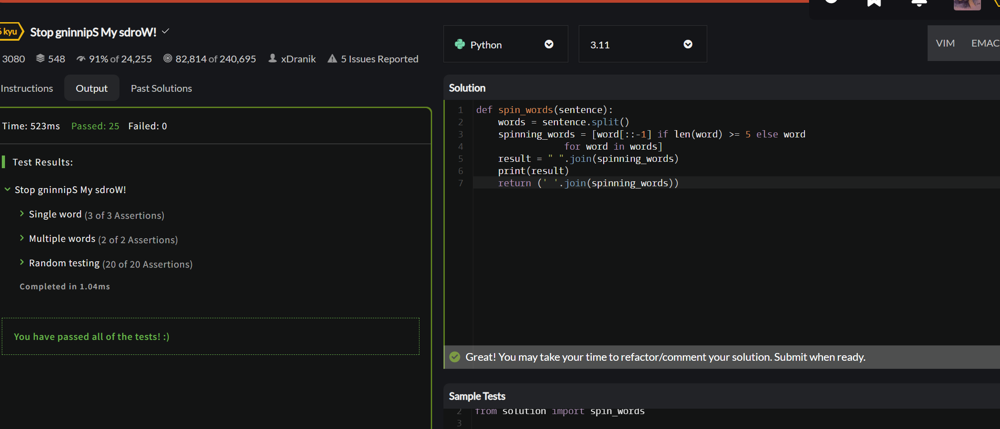
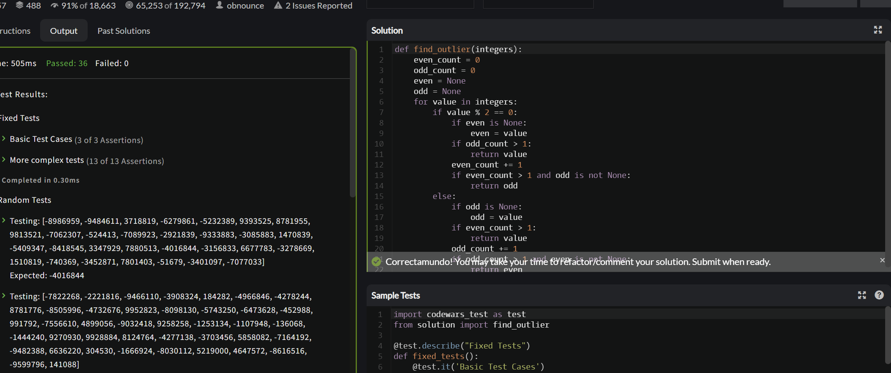
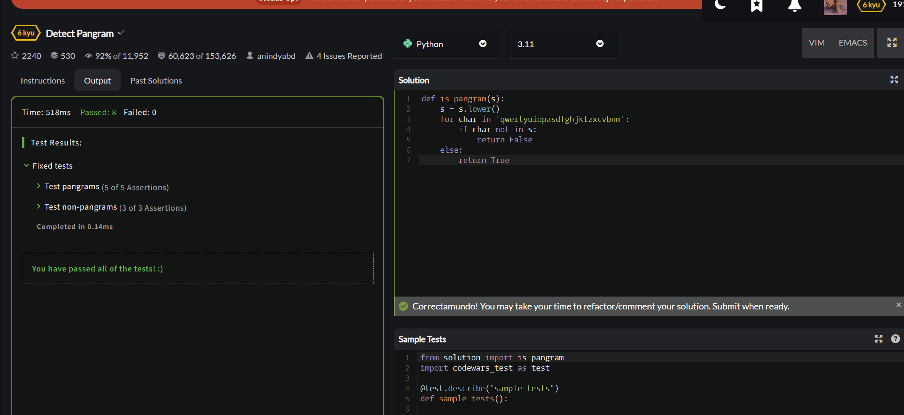
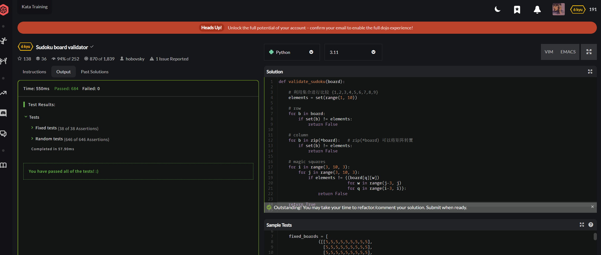
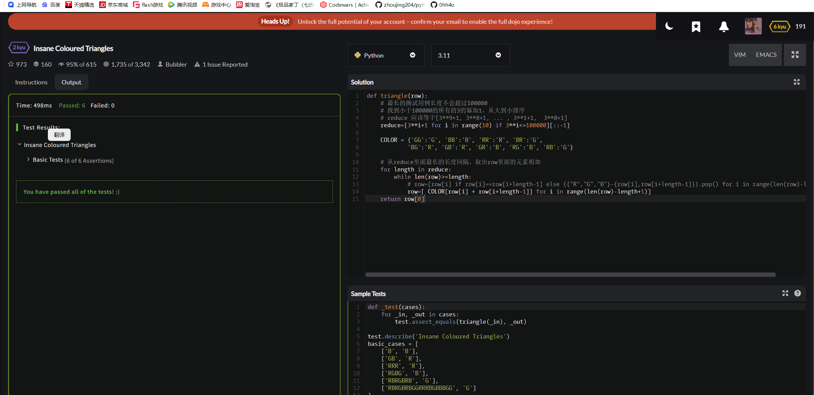

# 实验五 Python数据结构与数据模型

班级： 21计科03

学号： B20210302322

姓名： 董一浩

Github地址：<https://github.com/ByL1eng/xuexi>


CodeWars地址：<https://www.codewars.com/users/ByL1eng>

---

## 实验目的

1. 学习Python数据结构的高级用法
2. 学习Python的数据模型

## 实验环境

1. Git
2. Python 3.10
3. VSCode
4. VSCode插件

## 实验内容和步骤

### 第一部分

在[Codewars网站](https://www.codewars.com)注册账号，完成下列Kata挑战：

---

#### 第一题：停止逆转我的单词

难度： 6kyu

编写一个函数，接收一个或多个单词的字符串，并返回相同的字符串，但所有5个或更多的字母单词都是相反的（就像这个Kata的名字一样）。传入的字符串将只由字母和空格组成。只有当出现一个以上的单词时，才会包括空格。
例如：

```python
spinWords( "Hey fellow warriors" ) => returns "Hey wollef sroirraw" 
spinWords( "This is a test") => returns "This is a test" 
spinWords( "This is another test" )=> returns "This is rehtona test"
```

代码提交地址：
<https://www.codewars.com/kata/5264d2b162488dc400000001>

提示：

- 利用str的split方法可以将字符串分为单词列表
例如：

```python
words = "hey fellow warrior".split()
# words should be ['hey', 'fellow', 'warrior']
```

- 利用列表推导将长度大于等于5的单词反转(利用切片word[::-1])
- 最后使用str的join方法连结列表中的单词。

---

#### 第二题： 发现离群的数(Find The Parity Outlier)

难度：6kyu

给你一个包含整数的数组（其长度至少为3，但可能非常大）。该数组要么完全由奇数组成，要么完全由偶数组成，除了一个整数N。请写一个方法，以该数组为参数，返回这个 "离群 "的N。

例如：

```python
[2, 4, 0, 100, 4, 11, 2602, 36]
# Should return: 11 (the only odd number)

[160, 3, 1719, 19, 11, 13, -21]
# Should return: 160 (the only even number)
```

代码提交地址：
<https://www.codewars.com/kata/5526fc09a1bbd946250002dc>

---

#### 第三题： 检测Pangram

难度：6kyu

pangram是一个至少包含每个字母一次的句子。例如，"The quick brown fox jumps over the lazy dog "这个句子就是一个pangram，因为它至少使用了一次字母A-Z（大小写不相关）。

给定一个字符串，检测它是否是一个pangram。如果是则返回`True`，如果不是则返回`False`。忽略数字和标点符号。
代码提交地址：
<https://www.codewars.com/kata/545cedaa9943f7fe7b000048>

---

#### 第四题： 数独解决方案验证

难度：6kyu

数独背景

数独是一种在 9x9 网格上进行的游戏。游戏的目标是用 1 到 9 的数字填充网格的所有单元格，以便每一列、每一行和九个 3x3 子网格（也称为块）中的都包含数字 1 到 9。更多信息请访问：<http://en.wikipedia.org/wiki/Sudoku>

编写一个函数接受一个代表数独板的二维数组，如果它是一个有效的解决方案则返回 true，否则返回 false。数独板的单元格也可能包含 0，这将代表空单元格。包含一个或多个零的棋盘被认为是无效的解决方案。棋盘总是 9 x 9 格，每个格只包含 0 到 9 之间的整数。

代码提交地址：
<https://www.codewars.com/kata/63d1bac72de941033dbf87ae>

---

#### 第五题： 疯狂的彩色三角形

难度： 2kyu

一个彩色的三角形是由一排颜色组成的，每一排都是红色、绿色或蓝色。连续的几行，每一行都比上一行少一种颜色，是通过考虑前一行中的两个相接触的颜色而产生的。如果这些颜色是相同的，那么新的一行就使用相同的颜色。如果它们不同，则在新的一行中使用缺失的颜色。这个过程一直持续到最后一行，只有一种颜色被生成。

例如：
```python
Colour here:            G G        B G        R G        B R
Becomes colour here:     G          R          B          G
```


一个更大的三角形例子：

```python
R R G B R G B B
 R B R G B R B
  G G B R G G
   G R G B G
    B B R R
     B G R
      R B
       G
```

你将得到三角形的第一行字符串，你的工作是返回最后的颜色，这将出现在最下面一行的字符串。在上面的例子中，你将得到 "RRGBRGBB"，你应该返回 "G"。
限制条件： 1 <= length(row) <= 10 ** 5
输入的字符串将只包含大写字母'B'、'G'或'R'。

例如：

```python
triangle('B') == 'B'
triangle('GB') == 'R'
triangle('RRR') == 'R'
triangle('RGBG') == 'B'
triangle('RBRGBRB') == 'G'
triangle('RBRGBRBGGRRRBGBBBGG') == 'G'
```

代码提交地址：
<https://www.codewars.com/kata/5a331ea7ee1aae8f24000175>

提示：请参考下面的链接，利用三进制的特点来进行计算。
<https://stackoverflow.com/questions/53585022/three-colors-triangles>

---

### 第二部分

使用Mermaid绘制程序流程图

安装VSCode插件：

- Markdown Preview Mermaid Support
- Mermaid Markdown Syntax Highlighting

使用Markdown语法绘制你的程序绘制程序流程图（至少一个），Markdown代码如下：


显示效果如下：

```mermaid
flowchart LR
    A[Start] --> B{Is it?}
    B -->|Yes| C[OK]
    C --> D[Rethink]
    D --> B
    B ---->|No| E[End]
```

查看Mermaid流程图语法-->[点击这里](https://mermaid.js.org/syntax/flowchart.html)

使用Markdown编辑器（例如VScode）编写本次实验的实验报告，包括[实验过程与结果](#实验过程与结果)、[实验考查](#实验考查)和[实验总结](#实验总结)，并将其导出为 **PDF格式** 来提交。

## 实验过程与结果

请将实验过程与结果放在这里，包括：

- [第一部分 Codewars Kata挑战](#第一部分)
- [第二部分 使用Mermaid绘制程序流程图](#第二部分)

注意代码需要使用markdown的代码块格式化，例如Git命令行语句应该使用下面的格式：


显示效果如下：

```bash
git init
git add .
git status
git commit -m "first commit"
```

如果是Python代码，应该使用下面代码块格式，例如：


显示效果如下：

```python
def add_binary(a,b):
    return bin(a+b)[2:]
```

### 第一问：停止逆转我的单词



```python

def spin_words(sentence):
    words = sentence.split()
    spinning_words = [word[::-1] if len(word) >= 5 else word 
                for word in words]
    result = " ".join(spinning_words)
    print(result)
    return (' '.join(spinning_words))  

```

- 利用列表推导将长度大于等于5的单词反转(利用切片word[::-1])
- 最后使用str的join方法连结列表中的单词。

---

#### 第二问： 发现离群的数(Find The Parity Outlier)



```python

def find_outlier(integers):
    even_count = 0
    odd_count = 0
    even = None
    odd = None
    for value in integers:
        if value % 2 == 0:
            if even is None:
                even = value
            if odd_count > 1:
                return value
            even_count += 1
            if even_count > 1 and odd is not None:
                return odd 
        else:
            if odd is None:
                odd = value
            if even_count > 1:
                return value
            odd_count += 1
            if odd_count > 1 and even is not None:
                return even 

```

---

#### 第三问： 检测Pangram



```python

def is_pangram(s):
    s = s.lower()
    for char in 'qwertyuiopasdfghjklzxcvbnm':
        if char not in s:
            return False
    else:
        return True
```

---

#### 第四问： 数独解决方案验证



```python

def validate_sudoku(board):
    
    # 利用集合进行比较 {1,2,3,4,5,6,7,8,9}
    elements = set(range(1, 10))
    
    # row
    for b in board:
        if set(b) != elements: 
            return False
    
    # column
    for b in zip(*board):   # zip(*board) 可以将矩阵转置
        if set(b) != elements: 
            return False
    
    # magic squares
    for i in range(3, 10, 3):
        for j in range(3, 10, 3):
            if elements != {(board[q][w]) 
                            for w in range(j-3, j) 
                            for q in range(i-3, i)}:
                return False
            
    return True

```

---

#### 第五问： 疯狂的彩色三角形

难度： 2kyu

```python

def triangle(row):
    # 最长的测试用例长度不会超过100000
    # 找到小于100000的所有的3的幂加1，从大到小排序
    # reduce 应该等于[3**9+1, 3**8+1, ... , 3**1+1,  3**0+1]
    reduce=[3**i+1 for i in range(10) if 3**i<=100000][::-1]
    
    COLOR = {'GG':'G', 'BB':'B', 'RR':'R', 'BR':'G', 
            'BG':'R', 'GB':'R', 'GR':'B', 'RG':'B', 'RB':'G'}
    
    # 从reduce里面最长的长度间隔，取出row里面的元素相加
    for length in reduce:
        while len(row)>=length:
            # row=[row[i] if row[i]==row[i+length-1] else ({"R","G","B"}-{row[i],row[i+length-1]}).pop() for i in range(len(row)-length+1)]
            row=[ COLOR[row[i] + row[i+length-1]] for i in range(len(row)-length+1)]
    return row[0]
```



## 第二部分语法图

使用Mermaid绘制程序流程图

显示效果如下：

```mermaid
flowchart LR
    A[for char in qwertyuiopasdfghjklzxcvbnm] --> B{if char not  in qwertyuiopasdfghjklzxcvbnm?}
    B -->|Yes| C[reutn false]
    B ---->|No| E[return true]
```

代码运行结果的文本可以直接粘贴在这里。

**注意：不要使用截图，因为Markdown文档转换为Pdf格式后，截图会无法显示。**

## 实验考查

请使用自己的语言并使用尽量简短代码示例回答下面的问题，这些问题将在实验检查时用于提问和答辩以及实际的操作。

### 1. 集合（set）类型有什么特点？它和列表（list）类型有什么区别？

答：
集合类型（set）和列表类型（list）都是可变对象，但是集合类型不允许重复元素，并且集合类型中的元素是无序

### 2. 集合（set）类型主要有那些操作？

答：集合（set）类型主要有那些操作

### 3. 使用`*`操作符作用到列表上会产生什么效果？为什么不能使用`*`操作符作用到嵌套的列表上？使用简单的代码示例说明

答：当你尝试使用 * 操作符直接作用于嵌套的列表时，它会产生一个意想不到的效果，因为 * 操作符在这种情况下不会按照预期展开嵌套列表，而是复制了对嵌套列表的引用。这意味着对复制后的嵌套列表的更改也会影响原始列表，这可能会导致意想不到的行为。

例如：

```python

nested_list = [[1, 2], [3, 4]]
duplicated_list = nested_list * 2
print(duplicated_list)

nested_list[0][0] = 5
print(duplicated_list)

```

输出：

```python

[[1, 2], [3, 4], [1, 2], [3, 4]]
[[5, 2], [3, 4], [5, 2], [3, 4]]

```

在这个示例中，* 操作符并没有按预期展开嵌套列表，而是简单地复制了对嵌套列表的引用。因此，对原始列表的更改也会影响复制后的列表。

因此，在处理嵌套列表时，最好使用列表解析或其他方法来展开嵌套列表，而不是直接使用 * 操作符。

### 4. 总结列表,集合，字典的解析（comprehension）的使用方法。使用简单的代码示例说明

答：列表解析（List Comprehension）
列表解析提供了一种简洁的方法来创建新的列表，它通常比传统的 for 循环更简洁和可读。

传统的 for 循环创建列表
squares = []
for x in range(1, 6):
    squares.append(x ** 2)

使用列表解析创建列表
squares = [x ** 2 for x in range(1, 6)]

print(squares)  # 输出 [1, 4, 9, 16, 25]
集合解析（Set Comprehension）
集合解析类似于列表解析，但它创建的是集合而不是列表。它消除了重复的元素，并且具有和列表解析类似的语法。

创建包含平方数的集合
squares_set = {x ** 2 for x in range(1, 6)}

print(squares_set)  # 输出 {1, 4, 9, 16, 25}
字典解析（Dictionary Comprehension）
字典解析允许您根据现有的可迭代对象创建新的字典，它提供了一种简洁的方法来创建字典。

 创建一个字典，将数字映射到它们的平方
squares_dict = {x: x ** 2 for x in range(1, 6)}

print(squares_dict)  # 输出 {1: 1, 2: 4, 3: 9, 4: 16, 5: 25}

## 实验总结

总结一下这次实验你学习和使用到的知识，例如：编程工具的使用、数据结构、程序语言的语法、算法、编程技巧、编程思想。
在本次学习中我学到了Python中的*操作符可用于列表重复元素和展开列表。列表解析可简化列表、集合和字典的创建。集合解析消除重复元素，字典解析用于创建字典。这些工具使代码更简洁、可读，并提高效率